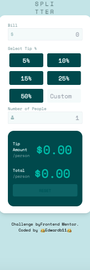
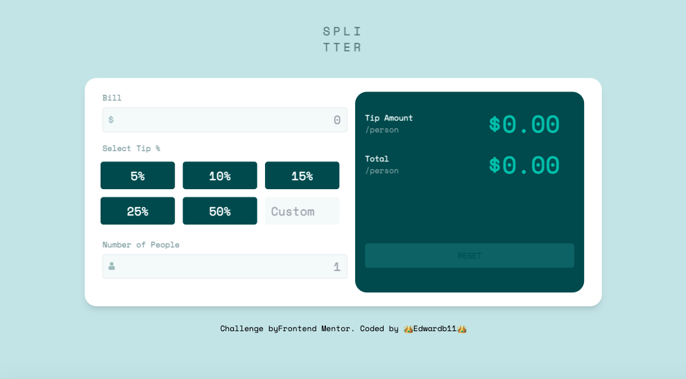

# Frontend Mentor - Tip calculator app solution


This is a solution to the [Tip calculator app challenge on Frontend Mentor](https://www.frontendmentor.io/challenges/tip-calculator-app-ugJNGbJUX). Frontend Mentor challenges help you improve your coding skills by building realistic projects.

## Table of contents

- [Frontend Mentor - Tip calculator app solution](#frontend-mentor---tip-calculator-app-solution)
  - [Table of contents](#table-of-contents)
  - [Overview](#overview)
    - [The challenge](#the-challenge)
    - [Screenshot](#screenshot)
        - [Mobile: 375px 📱](#mobile-375px-)
    - [Links](#links)
  - [My process](#my-process)
    - [Built with](#built-with)
    - [What I learned](#what-i-learned)
    - [Continued development](#continued-development)
    - [Useful resources](#useful-resources)
  - [Author](#author)

## Overview

### The challenge

Users should be able to:

- View the optimal layout for the app depending on their device's screen size
- See hover states for all interactive elements on the page
- Calculate the correct tip and total cost of the bill per person

### Screenshot

##### Mobile: 375px 📱





### Links

- Solution URL: [Tip-calculator-app](https://github.com/Edwardb11/Tip-calculator-app)
- Live Site URL: [Add live site URL here]()

## My process

### Built with

- Mobile-first workflow
- [React](https://reactjs.org/) - JS library
- [Tailwind CSS](https://tailwindcss.com/) - React framework


### What I learned

```html
<h1>Some HTML code I'm proud of</h1>
```
```css
.proud-of-this-css {
  color: papayawhip;
}
```
```js
const proudOfThisFunc = () => {
  console.log('🎉')
}
```


### Continued development

Use this section to outline areas that you want to continue focusing on in future projects. These could be concepts you're still not completely comfortable with or techniques you found useful that you want to refine and perfect.


### Useful resources


## Author

- Website - [Edward Brito Diaz](https://edwardb11.github.io/#)
- Frontend Mentor - [@Edwardb11](https://www.frontendmentor.io/profile/Edwardb11)
- Twitter - [@brito_edward11](https://twitter.com/brito_edward11)


